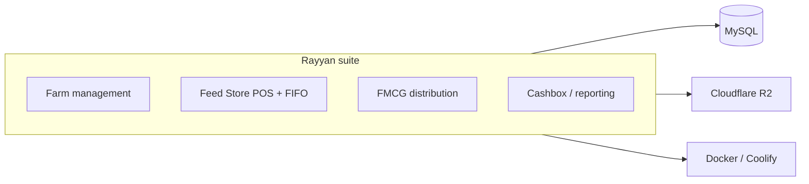

# Rayyan Group Business Suite — Showcase

> 🔒 **Source is private** (owned on another account / commercial). Happy to walk through the architecture in an interview.

Four Django web applications and a brand portal for **B2B operations**: farm management, retail Feed Store POS with **FIFO inventory**, FMCG distribution with **multi-company data isolation**, and cashbox / profit reporting dashboards.

## Overview

Four Django B2B apps + brand portal: farm management, Feed Store POS with FIFO inventory, FMCG distribution with multi-company isolation, cashbox/profit dashboards.

## Links

- **Live:** https://rayanagro.group
- **This repo:** portfolio write-up only — no application source

## Role

**Sole developer** — four repos, final technical decisions, deploy/ops on Docker + Coolify.

## Key Features

- Farm management workflows
- Retail Feed Store POS with FIFO inventory
- FMCG distribution with multi-company data isolation
- Cashbox and profit reporting dashboards
- Brand portal for Rayyan Group properties

## Tech stack

| Layer | Stack |
| :--- | :--- |
| Apps | Python 3.12, Django 4.2 |
| Data | MySQL |
| Infra | Docker, Coolify, Cloudflare R2 |

## Dependencies

No installable source in this showcase. Product stack: Python 3.12, Django 4.2, MySQL, Docker, Coolify, Cloudflare R2.

## How to run locally

Source is private (owned elsewhere). Use https://rayanagro.group — there is nothing to run from this repo.

## Architecture (high level)

## Screenshots

<!-- Add 2–4 dashboard/POS screenshots under docs/screenshots/ when available -->

## Source

No source is published here. Repos are owned/hosted outside this profile.
